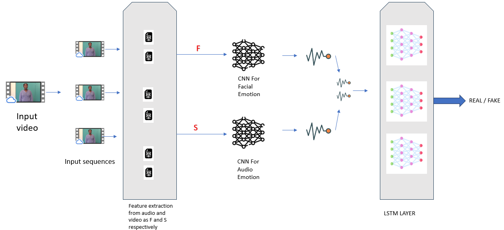

# Detecting-Deepfake-Using-Audio-and-Visual-Emotion-Synchronization

We have proposed a method to detect Deepfake video using facial and audio synchronization. We detect incosistencies between audio emotions and facial emotions to classify our video. This research is conducted to prevent frauds in a live video call. We have acheived accuracy of 95% on DFDC dataset. This code is designed to be very flxible for using custom attributes in different steps.



1. Use below link to download pre-trained models for emotion detection. Extract this model.rar file and place 'model' folder in the root directory.
(https://drive.google.com/file/d/1lPd-BwcC6kNJbX3KX65fwTYtnI4Hb0Oi/view?usp=sharing)


2. First filter out your dataset in which there is only one actor in a video. For this purpose run a below script. Remember to change path in a code. Also you will need to download yolo weights for this script.  
   ```bash
   python face.py

3. For Pre-procesing run following script. Also change all the paths in the script for your dataset and outputs.
    ```bash
     python preprocess.py

4. For Training run
   ```bash
   python train.py or python load_numpy.py


5. For evaluation run
   ```bash
   python eval.py
